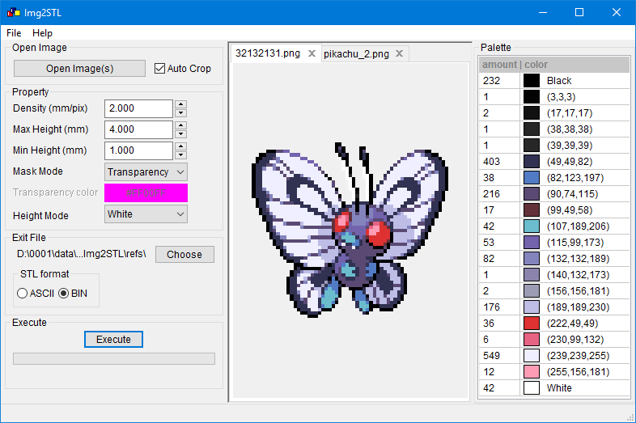
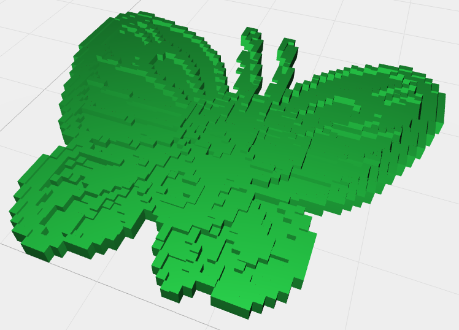

# Img2STL

Application for converting images to STL (3D-model for printing)

## Installing
Before installing, make sure you have Python version 3.7 installed.\
Otherwise, install it from [python site][python_site]

Then type to console:\
`pip install Img2STL`

## Usage
After install, you may launch this app with next command:\
`python -m Img2STL`

The program window is as follows:

###### Open Image
 * `Open Image(s)` Opens one or more images
 * `Auto Crop` Automatic cropping of opened files
 if there are transparent areas

###### Property
 * `Density` Pixel size on a real model in mm
 * `Max/Min Height` Max/Min thickness of the model in mm
 * `Mask Mode`: `Transparency` `Color` Choose a base color that will not be
 used when creating the model (mask)
 * `Height Mode`: `Black` `White` During image processing, a copy of it in
 grayscale will be created. If the "Black" mode is selected, the darker the
 pixel, the greater the thickness of the final model in the place corresponding
 to this pixel, and vice versa, if the "White" mode is selected

###### Exit File
 * Choose a place to save files.
 * `STL Format`: `ASCII` / `BIN` Choose a method to save the destination file.
ASCII is a plain text file. BIN is a binary format. It is recommended to use
a binary format, as large models in text format can have a very large size

###### Execute
 * `Execete` Begin the process of converting
 * This shows the progress of execution of conversion

###### Palette
 * The color palette of the selected file is displayed here. The "amount" field
 shows the number of pixels of the corresponding color in the "color" field

###### Image field
All open files are displayed here. Access to them is carried out on tabs with
file names

#### Exit file
In the end, a stl file with a 3D model will be created, which can be viewed 
using the appropriate application (for example, the 3DView plugin for Google
Chrome browser):

[latest_release]: https://github.com/baskiton/Img2STL/releases/latest
[python_site]: https://www.python.org/
[wx_site]: https://wxpython.org/pages/downloads/
